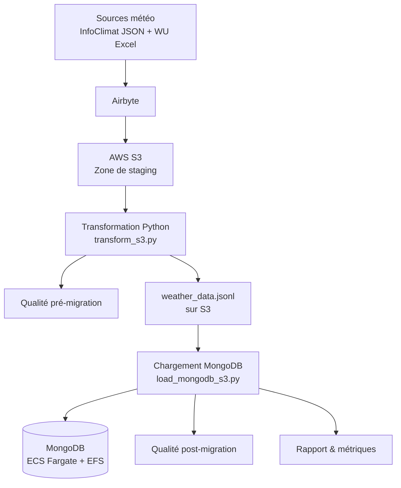

# Projet P8 – Forecast 2.0 | Pipeline Data Engineering & MongoDB sur AWS

## Objectif

Concevoir et déployer un pipeline ETL complet de traitement de données météorologiques multi-sources pour **GreenAndCoop**, coopérative énergétique française. Le pipeline collecte, normalise, contrôle et charge les données dans une base **MongoDB hébergée sur AWS ECS Fargate**, prête à alimenter des modèles de prévision de demande énergétique.

Le projet couvre l'ensemble du cycle data engineering :

- Ingestion de données hétérogènes (JSON API, Excel) depuis 6 stations météo
- Normalisation dans un schéma commun unifié
- Contrôles qualité pré et post-migration
- Migration sécurisée vers MongoDB avec validation de schéma
- Conteneurisation Docker pour reproductibilité
- Déploiement cloud sur AWS (S3, ECS Fargate, EFS)

## Architecture du pipeline

```
┌─────────────────────────────────────────────────────────────────────┐
│  SOURCES                                                            │
│  ├── InfoClimat API (JSON) → 4 stations françaises                 │
│  └── Weather Underground (Excel) → 2 stations (BE + FR)            │
│                                                                     │
│  INGESTION                                                          │
│  └── Airbyte (Docker local) → AWS S3 (zone de staging)            │
│                                                                     │
│  TRANSFORMATION                                                     │
│  └── Python (transform_s3.py) → Normalisation + qualité            │
│       → weather_data.jsonl sur S3                                   │
│                                                                     │
│  CHARGEMENT                                                         │
│  └── Python (load_mongodb_s3.py) → MongoDB sur ECS Fargate         │
│                                                                     │
│  STOCKAGE                                                           │
│  └── MongoDB 7 sur AWS ECS Fargate + EFS (persistance)             │
│                                                                     │
│  MONITORING                                                         │
│  └── CloudWatch Logs + rapports qualité JSON                       │
└─────────────────────────────────────────────────────────────────────┘
```

## Sources de données

| Source | Format | Stations | Observations |
|--------|--------|----------|-------------|
| InfoClimat API | JSON imbriqué | 4 (Lille-Lesquin, Armentières, Bergues, Hazebrouck) | 1 143 |
| Weather Underground | Excel (.xlsx) | 2 (Ichtegem BE, La Madeleine FR) | 3 807 |
| **Total** | | **6 stations** | **4 950 records** |

Période couverte : **2024-01-10 → 2024-10-07**

## Arborescence du projet

```
P8/
├── 01_Recuperation_et_Transformation_Donnees/
│   ├── transform.py              # Normalisation multi-sources → schéma commun
│   ├── weather_data.json         # Données transformées
│   └── weather_data.quality.json # Rapport qualité pré-migration
│
├── 02_Chargement_DB/
│   ├── load_mongodb.py           # Migration vers MongoDB (local ou distant)
│   └── mongodb_report.json       # Rapport qualité post-migration
│
├── 03_Docker/
│   ├── docker-compose.yml        # Stack MongoDB locale
│   ├── Dockerfile                # Image Python pipeline
│   └── requirements.txt
│
├── 04_Deploiement_AWS/
│   └── Scripts/
│       ├── transform_s3.py       # Transformation depuis/vers S3
│       ├── load_mongodb_s3.py    # Chargement S3 → MongoDB ECS
│       └── test_mongodb_aws.py   # Tests de connectivité et intégrité AWS
│
├── 05_tests/
│   ├── __init__.py
│   └── test_transform.py         # Tests unitaires transformation
│
├── data/
│   ├── airbyte/                  # Configuration Airbyte locale
│   ├── Data_Source1_011024-071024.json  # Source InfoClimat brute
│   ├── Ichtegem_BE.xlsx          # Source Weather Underground Belgique
│   ├── infoclimat_hourly.json    # Données horaires InfoClimat
│   └── La_Madeleine_FR.xlsx      # Source Weather Underground France
│
├── docs/
│   ├── ARCHITECTURE_AWS.md       # Documentation architecture cloud
│   ├── LOGIGRAMME.md             # Diagramme de flux du pipeline
│   └── SCHEMA_BDD.md             # Schéma de la base de données
│
├── scripts/
│   ├── run_pipeline.sh           # Orchestration complète du pipeline
│   ├── load_mongodb_s3.py        # Script de chargement (présentation)
│   ├── transform_s3.py           # Script de transformation (présentation)
│   └── requirements.txt
│
├── .env                          # Variables d'environnement (non versionné)
├── .gitignore
├── README.md
└── requirements.txt
```

## Prérequis

- Python 3.10+
- Docker & Docker Compose
- Compte AWS avec accès S3, ECS, EFS
- AWS CLI configuré (`aws configure`)
- Ports MongoDB disponibles (27017)

## Configuration (.env)

```bash
# AWS / S3
S3_BUCKET=oc-meteo-staging-data
AWS_REGION=eu-west-3

# MongoDB (local)
MONGO_URI=mongodb://localhost:27017
MONGO_DB=weather_db

# MongoDB (AWS ECS)
# MONGO_URI=mongodb://admin:<password>@<ECS_PUBLIC_IP>:27017/
```

## Démarrage rapide

### Exécution locale

```bash
# 1. Démarrage MongoDB local
docker compose -f 03_Docker/docker-compose.yml up -d

# 2. Transformation des données brutes
python3 01_Recuperation_et_Transformation_Donnees/transform.py

# 3. Chargement en base
python3 02_Chargement_DB/load_mongodb.py
```

### Exécution cloud (AWS)

```bash
# Pipeline complet via le script d'orchestration
bash scripts/run_pipeline.sh
```

Le pipeline est **idempotent** et peut être relancé sans effet de bord.

## Tests

```bash
# Lancer les tests unitaires
python3 -m pytest 05_tests/ -v

# Test de connectivité MongoDB AWS
python3 04_Deploiement_AWS/Scripts/test_mongodb_aws.py
```

## Infrastructure AWS

### MongoDB sur ECS Fargate

MongoDB 7 est déployé comme service ECS Fargate avec :

- **EFS** (Elastic File System) pour la persistance des données entre redéploiements
- **Security Groups** configurés pour l'accès MongoDB (port 27017)
- **CloudWatch** pour le monitoring et les logs

### Rôle d'Airbyte

Airbyte est utilisé pour l'extraction et le chargement des données sources vers la zone de staging S3. Les transformations, contrôles qualité et migrations MongoDB sont réalisés **hors Airbyte** afin de :

- Maîtriser les règles métier de normalisation
- Centraliser la logique de qualité des données
- Garantir la cohérence des données avant insertion en base

## Qualité des données

### Pré-migration

Le script `transform.py` effectue :

- Vérification des types et champs obligatoires
- Détection des doublons et valeurs manquantes
- Rapport généré dans `weather_data.quality.json`

### Post-migration

Le script `load_mongodb.py` génère un rapport contenant :

- Nombre de documents soumis, insérés, rejetés
- Taux d'erreur post-migration
- Répartition par source et par station

### Validation MongoDB

- **Schema validation** (`$jsonSchema`) appliquée côté base
- **Index uniques** sur `(station_id, timestamp)` pour empêcher les doublons
- **Index fonctionnels** sur `source` et `timestamp` pour les requêtes

## Métriques de performance

| Métrique | Valeur |
|----------|--------|
| Records traités | 4 950 |
| Temps de chargement (S3 → MongoDB ECS) | ~1.3 secondes |
| Erreurs d'insertion | 0 |
| Doublons | 0 |
| Sources unifiées | 2 (InfoClimat + Weather Underground) |
| Stations couvertes | 6 |

## Choix de conception

- **Pipeline multi-sources** avec normalisation centralisée vers un schéma unique
- **Validation côté base** MongoDB (`$jsonSchema`) pour garantir l'intégrité
- **Séparation des responsabilités** : ingestion (Airbyte) / transformation (Python) / stockage (MongoDB)
- **Pipeline idempotent** et relançable grâce aux upserts et index uniques
- **Déploiement cloud** sur ECS Fargate pour un environnement production-ready
- **Architecture compatible industrialisation** : séparation claire des étapes, logs, métriques, tests

## Documentation complémentaire

- [`docs/ARCHITECTURE_AWS.md`](docs/ARCHITECTURE_AWS.md) — Architecture cloud détaillée
- [`docs/LOGIGRAMME.md`](docs/LOGIGRAMME.md) — Diagramme de flux du pipeline
- [`docs/SCHEMA_BDD.md`](docs/SCHEMA_BDD.md) — Schéma de la base de données

## Logigramme du pipeline

[Voir le diagramme Mermaid interactif](https://mermaid.ai/d/19e27a95-edb3-48dd-8376-31d66ff93959)


