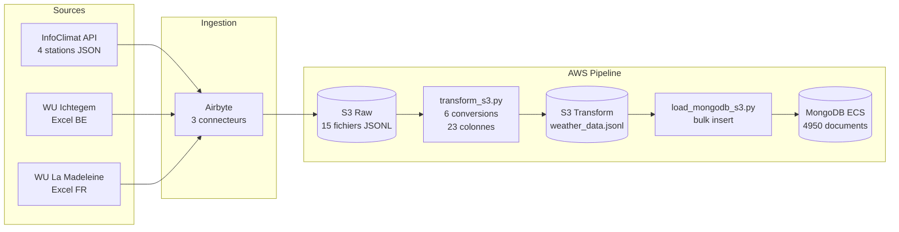

<h1 align="center">Forecast 2.0</h1>

<p align="center">
  <b>Pipeline ETL Meteo Cloud-Native</b><br>
  Airbyte &middot; S3 &middot; Python &middot; MongoDB &middot; AWS ECS Fargate
</p>

<p align="center">
  
  
  
  
  
  
</p>

---

> **Auteur :** Mathieu Lowagie
> **Formation :** Master 2 Data Engineering - OpenClassrooms
> **Projet :** P8 - Construisez et testez une infrastructure de donnees
> **Date :** Fevrier 2026

---

## Objectif

Construire un pipeline ETL cloud-native pour collecter, transformer et stocker des donnees meteorologiques multi-sources destinees a alimenter des modeles de prevision de demande energetique (Forecast 2.0 - GreenAndCoop).

---

## Architecture



### Composants AWS

| Composant | Configuration | Etat |
|-----------|--------------|------|
| **MongoDB ECS** | Fargate 0.5 vCPU, 1 GB RAM | `RUNNING` |
| **EFS Storage** | 6 GB General Purpose | `Persistant` |
| **S3 Bucket** | `oc-meteo-staging-data` | `Actif` |
| **Security Group** | `mongodb-forecast-sg` | `Configure` |
| **CloudWatch Logs** | `/ecs/mongodb-forecast` | `Actif` |

---

## Sources de donnees

| Source | Type | Stations | Periode | Records |
|--------|------|----------|---------|---------|
| InfoClimat | JSON (API) | 4 (Hauts-de-France) | 01-07 Oct 2024 | **1143** |
| WU Belgique | Excel (XLSX) | IICHTE19 (Ichtegem) | Jan-Jul 2024 | **1899** |
| WU France | Excel (XLSX) | ILAMAD25 (La Madeleine) | Jan-Jul 2024 | **1908** |

---

## Schema MongoDB

> Collection `weather_db.weather_data` — **4950 documents**, **23 champs**, validation `strict/error`

```json
{
  "_id":               "ObjectId",
  "station_id":        "IICHTE19",
  "timestamp":         "2024-07-01T12:00:00Z",
  "source":            "wu_ichtegem | wu_madeleine | infoclimat",
  "temperature_c":     22.3,
  "humidity_pct":      68,
  "pressure_hpa":      1013.2,
  "wind_speed_kmh":    15.4,
  "wind_dir_deg":      270,
  "precipitation_mm":  0.0,
  "dewpoint_c":        14.2,
  "windchill_c":       20.1,
  "heat_index_c":      23.0,
  "wind_gust_kmh":     25.0,
  "uv_index":          5,
  "solar_radiation":   450.0,
  "feels_like_c":      22.0,
  "precip_rate_mm":    0.0,
  "precip_total_mm":   2.5,
  "station_type":      "weather_underground",
  "elevation_m":       null,
  "latitude":          null,
  "longitude":         null
}
```

**Index :**

| Nom | Champs | Type |
|-----|--------|------|
| `idx_station_ts` | `station_id` + `timestamp` | **Unique** (dedup) |
| `idx_source` | `source` | Standard |
| `idx_timestamp` | `timestamp` | Standard |

---

## Transformations

| Mesure | Entree (WU) | Sortie | Formule |
|--------|-------------|--------|---------|
| Temperature | `degF` | `degC` | `(F - 32) * 5/9` |
| Vent | `mph` | `km/h` | `mph * 1.60934` |
| Pression | `inHg` | `hPa` | `inHg * 33.8639` |
| Precipitation | `inches` | `mm` | `in * 25.4` |
| Direction vent | `Texte` | `Degres` | Mapping cardinal &rarr; 0-360 |

---

## Quickstart

### 1. Prerequis

```bash
python3 --version   # Python 3.11+
aws configure       # AWS CLI configure
```

### 2. Installation

```bash
git clone https://github.com/Melkia44/P8.git
cd P8
pip install -r requirements.txt --break-system-packages
```

### 3. Configuration

```bash
cp .env.example .env
```

> Editer `.env` avec vos credentials MongoDB et AWS :
>
> ```env
> MONGO_URI=mongodb://admin:<password>@<ECS_IP>:27017/
> DB_NAME=weather_db
> BUCKET_NAME=oc-meteo-staging-data
> AWS_REGION=eu-west-3
> ```

### 4. Execution locale (Docker)

```bash
cd 03_Docker
docker compose up --build
```

<details>
<summary>Resultat attendu</summary>

```
mongodb-forecast  | Replica Set initialized
etl-service       | Transform: 4950 records
etl-service       | Load: 4950 inserted, 0 errors
```

</details>

### 5. Execution AWS

```bash
source .env
python3 scripts/transform_s3.py
python3 scripts/load_mongodb_s3.py
```

<details>
<summary>Resultat attendu</summary>

```
INFO  Reading S3 raw/...
INFO  Type: weather_underground -> 3807 records
INFO  Type: infoclimat -> 1143 records
INFO  Total: 4950 records -> S3 Transform/weather_data.jsonl

INFO  Loading from S3 Transform/...
INFO  Inserted: 4950 | Duplicates: 0 | Errors: 0
```

</details>

### 6. Tests

```bash
# Tests unitaires (40 tests)
pytest 05_tests/ -v

# Tests infrastructure AWS
export MONGO_URI='mongodb://admin:<password>@<ECS_IP>:27017/'
python3 04_Deploiement_AWS/Scripts/test_mongodb_aws.py
```

<details>
<summary>Resultat attendu</summary>

```
05_tests/test_transform.py::TestFahrenheitToCelsius::test_zero       PASSED
05_tests/test_transform.py::TestFahrenheitToCelsius::test_boiling    PASSED
...
========================= 40 passed in 0.15s =========================
```

</details>

---

## Structure du repo

```
P8/
├── README.md
├── .env.example              # Template de configuration
├── .gitignore
├── requirements.txt
│
├── 01_Recuperation_et_Transformation_Donnees/
│   └── transform.py          # Transform local
│
├── 02_Chargement_DB/
│   ├── load_mongodb.py        # Load local
│   └── mongodb_report.json
│
├── 03_Docker/
│   ├── Dockerfile
│   ├── docker-compose.yml     # 3 services: MongoDB RS + init + ETL
│   ├── requirements.txt
│   └── scripts/
│       ├── transform.py
│       ├── load_mongodb.py
│       └── run_pipeline.py
│
├── 04_Deploiement_AWS/
│   └── Scripts/
│       ├── transform_s3.py    # Transform S3 (prod)
│       ├── load_mongodb_s3.py # Load MongoDB AWS (prod)
│       └── test_mongodb_aws.py # 6 tests infra
│
├── 05_tests/
│   ├── __init__.py
│   └── test_transform.py     # 40 tests unitaires (pytest)
│
├── scripts/
│   ├── transform_s3.py        # Transform S3
│   ├── load_mongodb_s3.py     # Load MongoDB (env-based)
│   └── requirements.txt
│
├── data/
│   ├── Data_Source1_011024-071024.json  # InfoClimat
│   ├── Ichtegem_BE.xlsx                # WU Belgique
│   └── La_Madeleine_FR.xlsx            # WU France
│
└── docs/
    ├── SCHEMA_BDD.md          # Schema MongoDB 23 champs
    ├── LOGIGRAMME.md          # Flowchart ETL
    └── ARCHITECTURE_AWS.md    # Infra AWS, securite, couts
```

---

## Securite

| Mesure | Detail |
|--------|--------|
| **Credentials** | Variables d'environnement via `.env` (non commite) |
| **Reseau** | Security Group restrictif (port 27017, IP autorisee uniquement) |
| **Chiffrement** | EFS chiffre at rest, S3 SSE-S3, TLS en transit |
| **IAM** | Task Execution Role pour ECS (zero secret dans le code) |
| **Logs** | Fonction `redact_uri()` masque les passwords dans les logs |

---

## Justifications techniques

<details>
<summary><b>Pourquoi MongoDB (NoSQL) ?</b></summary>

- Schema flexible pour sources heterogenes (InfoClimat a nebulosite/code OMM, WU a UV/solar)
- Index optimises pour requetes time-series (`station_id` + `timestamp`)
- Scalabilite horizontale via sharding au-dela de 100M documents
- JSON Schema validation cote serveur (`strict/error`)

</details>

<details>
<summary><b>Pourquoi ECS Fargate (vs EC2) ?</b></summary>

- Serverless : pas de gestion de serveurs ni de patches
- Pay-per-use : ~21 EUR/mois (vs ~30 EUR/mois EC2 t3.micro 24/7)
- Auto-restart sur failure via ECS service
- Optimisable a ~3 EUR/mois en arretant MongoDB hors usage

</details>

<details>
<summary><b>Pourquoi S3 comme zone de staging ?</b></summary>

- Decouplage Extract / Transform / Load
- Tracabilite : donnees brutes toujours disponibles dans `raw/`
- Reprise sur erreur : si le transform echoue, les donnees sont intactes
- Cout negligeable : < 0.01 EUR/mois pour 6 MB

</details>

---

## Documentation detaillee

| Document | Contenu |
|----------|---------|
| [`SCHEMA_BDD.md`](docs/SCHEMA_BDD.md) | Schema MongoDB 23 champs, index, validation, statistiques |
| [`LOGIGRAMME.md`](docs/LOGIGRAMME.md) | Flowchart ETL complet (collecte &rarr; stockage) |
| [`ARCHITECTURE_AWS.md`](docs/ARCHITECTURE_AWS.md) | Infrastructure AWS, securite, couts, haute disponibilite |

---

## Ameliorations futures

| Horizon | Actions |
|---------|---------|
| **Court terme** | CI/CD GitHub Actions, AWS Secrets Manager, Makefile |
| **Moyen terme** | Replica Set MongoDB 3 noeuds, ALB, backup auto EFS |
| **Long terme** | Migration DocumentDB, orchestration Airflow/EventBridge, VPC prive |

---

<p align="center">
  <b>Version 2.0</b> &mdash; 22 fevrier 2026
</p>
