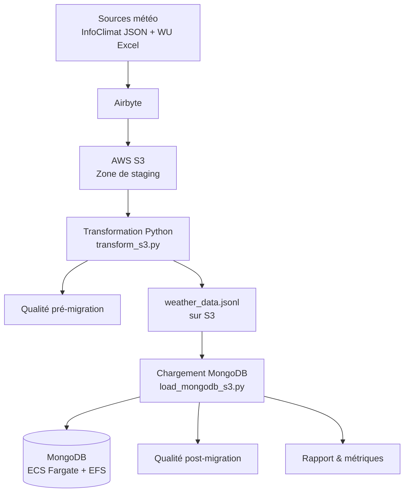

<div align="center">

# 🌦️☁️ Forecast 2.0 — Pipeline ETL multi-sources sur AWS

### Ingestion, normalisation, contrôle qualité et chargement de données météorologiques vers MongoDB hébergé sur AWS ECS Fargate

[](https://www.python.org/)
[](https://www.mongodb.com/)
[](https://airbyte.com/)
[](https://aws.amazon.com/)
[](https://www.docker.com/)
[](LICENSE)

**[Contexte](#-contexte-business)** • **[Architecture](#%EF%B8%8F-architecture-du-pipeline)** • **[Stack](#%EF%B8%8F-stack-technique)** • **[Démarrage](#-démarrage-rapide)** • **[Choix de conception](#-choix-de-conception)** • **[Métriques](#-métriques-de-performance)**

</div>

---

## 📋 Contexte business

**GreenAndCoop** est une coopérative énergétique française qui alimente ses modèles de prévision de demande à partir de données météorologiques multi-sources. Ces données proviennent de fournisseurs hétérogènes (formats JSON et Excel), de plusieurs stations situées en France et en Belgique, et doivent être unifiées dans un schéma commun puis chargées dans une base **MongoDB hébergée sur AWS** pour alimenter les modèles ML aval.

L'enjeu : concevoir un pipeline **production-ready** capable d'ingérer ces données, de les normaliser dans un schéma commun, de garantir leur qualité par des contrôles automatisés, et de les charger de façon **idempotente** dans une base MongoDB cloud — le tout reproductible via Docker et déployable sur AWS ECS Fargate.

---

## 🎯 Objectifs

- ✅ **Ingérer** des données météorologiques depuis 2 sources hétérogènes (API JSON + Excel) couvrant 6 stations
- ✅ **Normaliser** les données dans un schéma commun unifié
- ✅ **Contrôler la qualité** des données pré et post-migration (doublons, valeurs manquantes, types)
- ✅ **Charger** les données dans MongoDB avec validation de schéma côté base (`$jsonSchema`)
- ✅ **Conteneuriser** le pipeline pour garantir la reproductibilité
- ✅ **Déployer** sur AWS (S3 staging + ECS Fargate compute + EFS persistance)

---

## 🏗️ Architecture du pipeline

```
┌─────────────────────────────────────────────────────────────────────┐
│  SOURCES                                                            │
│  ├── InfoClimat API (JSON)        → 4 stations françaises          │
│  └── Weather Underground (Excel)  → 2 stations (BE + FR)           │
│                                                                     │
│  INGESTION                                                          │
│  └── Airbyte (Docker local)        → AWS S3 (zone de staging)      │
│                                                                     │
│  TRANSFORMATION                                                     │
│  └── Python (transform_s3.py)      → Normalisation + qualité       │
│       → weather_data.jsonl sur S3                                   │
│                                                                     │
│  CHARGEMENT                                                         │
│  └── Python (load_mongodb_s3.py)   → MongoDB sur ECS Fargate       │
│                                                                     │
│  STOCKAGE                                                           │
│  └── MongoDB 7 sur AWS ECS Fargate + EFS (persistance)             │
│                                                                     │
│  MONITORING                                                         │
│  └── CloudWatch Logs + rapports qualité JSON                       │
└─────────────────────────────────────────────────────────────────────┘
```

**Diagramme Mermaid interactif** :


```mermaid
flowchart TD
    A[Sources météo<br/>InfoClimat JSON + WU Excel] --> B[Airbyte]
    B --> C[AWS S3<br/>Zone de staging]
    C --> D[Transformation Python<br/>transform_s3.py]
    D --> E[Qualité pré-migration]
    D --> F[weather_data.jsonl<br/>sur S3]
    F --> G[Chargement MongoDB<br/>load_mongodb_s3.py]
    G --> H[(MongoDB<br/>ECS Fargate + EFS)]
    G --> I[Qualité post-migration]
    G --> J[Rapport & métriques]
```

---

## 🛠️ Stack technique

| Composant | Technologie | Rôle |
|-----------|-------------|------|
| **Langage** | Python 3.10+ | Pipeline ETL |
| **Ingestion** | Airbyte (Docker local) | Extraction sources hétérogènes vers S3 |
| **Stockage staging** | AWS S3 | Zone de staging entre étapes ETL |
| **Compute** | AWS ECS Fargate | Hébergement MongoDB conteneurisé |
| **Persistance** | AWS EFS | Stockage persistant pour MongoDB |
| **Base NoSQL** | MongoDB 7 | Stockage final + validation `$jsonSchema` |
| **Conteneurisation** | Docker + Docker Compose | Reproductibilité environnement |
| **Monitoring** | AWS CloudWatch | Logs et métriques opérationnelles |
| **Tests** | pytest | Tests unitaires sur transformations |

---

## 📊 Sources de données

| Source | Format | Stations | Observations |
| --- | --- | --- | --- |
| InfoClimat API | JSON imbriqué | 4 (Lille-Lesquin, Armentières, Bergues, Hazebrouck) | 1 143 |
| Weather Underground | Excel (.xlsx) | 2 (Ichtegem BE, La Madeleine FR) | 3 807 |
| **Total** |  | **6 stations** | **4 950 records** |

**Période couverte** : 2024-01-10 → 2024-10-07

---

## 🚀 Démarrage rapide

### Prérequis

- Python 3.10+
- Docker & Docker Compose
- Compte AWS avec accès S3, ECS, EFS
- AWS CLI configuré (`aws configure`)
- Ports MongoDB disponibles (27017)

### Configuration (`.env`)

```bash
# AWS / S3
S3_BUCKET=oc-meteo-staging-data
AWS_REGION=eu-west-3

# MongoDB (local)
MONGO_URI=mongodb://localhost:27017
MONGO_DB=weather_db

# MongoDB (AWS ECS)
# MONGO_URI=mongodb://admin:<password>@<ECS_PUBLIC_IP>:27017/
```

### Exécution locale

```bash
# 1. Démarrage MongoDB local
docker compose -f 03_Docker/docker-compose.yml up -d

# 2. Transformation des données brutes
python3 01_Recuperation_et_Transformation_Donnees/transform.py

# 3. Chargement en base
python3 02_Chargement_DB/load_mongodb.py
```

### Exécution cloud (AWS)

```bash
# Pipeline complet via le script d'orchestration
bash scripts/run_pipeline.sh
```

Le pipeline est **idempotent** et peut être relancé sans effet de bord.

### Tests

```bash
# Tests unitaires
python3 -m pytest 05_tests/ -v

# Test de connectivité MongoDB AWS
python3 04_Deploiement_AWS/Scripts/test_mongodb_aws.py
```

---

## 📁 Structure du projet

```
Forecast-aws-airbyte-etl/
├── 01_Recuperation_et_Transformation_Donnees/
│   ├── transform.py                  # Normalisation multi-sources → schéma commun
│   ├── weather_data.json             # Données transformées
│   └── weather_data.quality.json     # Rapport qualité pré-migration
│
├── 02_Chargement_DB/
│   ├── load_mongodb.py               # Migration vers MongoDB (local ou distant)
│   └── mongodb_report.json           # Rapport qualité post-migration
│
├── 03_Docker/
│   ├── docker-compose.yml            # Stack MongoDB locale
│   ├── Dockerfile                    # Image Python pipeline
│   └── requirements.txt
│
├── 04_Deploiement_AWS/
│   └── Scripts/
│       ├── transform_s3.py           # Transformation depuis/vers S3
│       ├── load_mongodb_s3.py        # Chargement S3 → MongoDB ECS
│       └── test_mongodb_aws.py       # Tests de connectivité et intégrité
│
├── 05_tests/
│   └── test_transform.py             # Tests unitaires transformation
│
├── data/                             # Sources brutes
├── docs/
│   ├── ARCHITECTURE_AWS.md           # Documentation architecture cloud
│   ├── LOGIGRAMME.md                 # Diagramme de flux du pipeline
│   └── SCHEMA_BDD.md                 # Schéma de la base de données
├── scripts/
│   └── run_pipeline.sh               # Orchestration complète
├── .gitignore
├── README.md
└── requirements.txt
```

---

## 🧠 Choix de conception

### 1. Séparation stricte des responsabilités

- **Ingestion** (Airbyte) → uniquement extraction et chargement vers S3 staging
- **Transformation** (Python) → règles métier de normalisation et qualité
- **Stockage** (MongoDB) → validation finale via `$jsonSchema`

> 💡 **Pourquoi pas tout faire dans Airbyte** ? Garder les règles métier en Python permet de **maîtriser** la logique de normalisation, de la **versionner** dans le repo, et de la **tester unitairement**. Airbyte reste sur ce qu'il sait faire de mieux : extraire et charger.

### 2. Pipeline idempotent

Grâce aux **upserts** et aux **index uniques** (`station_id, timestamp`), le pipeline peut être **relancé sans effet de bord**. C'est une propriété critique pour la production : permet la reprise sur incident, le re-traitement de données corrigées, le déploiement bleu/vert.

### 3. Validation à deux niveaux

| Niveau | Outil | Garantie |
|--------|-------|----------|
| **Pré-insertion** | Python (`transform.py`) | Cohérence des types, détection doublons, gestion des NaN |
| **Insertion** | MongoDB `$jsonSchema` | Refus côté base de tout document non conforme |

→ Double filet de sécurité : ce qui passe le filtre Python est encore vérifié par MongoDB avant écriture.

### 4. MongoDB sur ECS Fargate + EFS

| Choix | Justification |
|-------|---------------|
| **ECS Fargate** plutôt qu'EC2 | Pas de gestion de serveur, scaling automatique, facturation à la seconde |
| **EFS** plutôt qu'EBS | Persistance partagée entre redéploiements de container (EBS est local) |
| **CloudWatch** pour le monitoring | Intégration native AWS, alerting facile à mettre en place |

### 5. Architecture compatible industrialisation

Séparation claire des étapes (`01_`, `02_`, `03_`, `04_`), logs centralisés, métriques de performance traçables, tests unitaires. Le repo peut être repris par une équipe DevOps pour CI/CD sans refonte.

---

## 📈 Qualité des données

### Pré-migration (`transform.py`)

- Vérification des types et champs obligatoires
- Détection des doublons et valeurs manquantes
- Rapport généré dans `weather_data.quality.json`

### Post-migration (`load_mongodb.py`)

Rapport contenant :
- Nombre de documents soumis, insérés, rejetés
- Taux d'erreur post-migration
- Répartition par source et par station

### Validation MongoDB

- **Schema validation** (`$jsonSchema`) appliquée côté base
- **Index uniques** sur `(station_id, timestamp)` pour empêcher les doublons
- **Index fonctionnels** sur `source` et `timestamp` pour les requêtes analytiques

---

## 📊 Métriques de performance

| Métrique | Valeur |
| --- | --- |
| Records traités | 4 950 |
| Temps de chargement (S3 → MongoDB ECS) | ~1.3 secondes |
| Erreurs d'insertion | 0 |
| Doublons | 0 |
| Sources unifiées | 2 (InfoClimat + Weather Underground) |
| Stations couvertes | 6 |

---

## 📂 Documentation complémentaire

- 📄 [`docs/ARCHITECTURE_AWS.md`](./docs/ARCHITECTURE_AWS.md) — Architecture cloud détaillée
- 📄 [`docs/LOGIGRAMME.md`](./docs/LOGIGRAMME.md) — Diagramme de flux du pipeline
- 📄 [`docs/SCHEMA_BDD.md`](./docs/SCHEMA_BDD.md) — Schéma de la base de données

---

## 🌱 Aller plus loin (V2)

- 🔄 **Orchestration** via Apache Airflow / Kestra plutôt qu'un script bash
- 📊 **Monitoring proactif** avec alerting CloudWatch + intégration Slack/Discord
- 🔐 **Secrets management** via AWS Secrets Manager (au lieu de `.env`)
- 🌍 **Multi-région** : réplication MongoDB cross-region pour HA
- 📈 **Métriques de drift** sur la qualité des données dans le temps

---

## 👤 Auteur

**Mathieu Lowagie**  
Data Engineer | Service Delivery Manager — 17 ans d'expérience B2B télécoms

🔗 [LinkedIn](https://www.linkedin.com/in/mathieu-pm/) • 💼 [GitHub](https://github.com/Melkia44)

---

## 📄 Licence

Projet réalisé dans le cadre du **Master 2 Data Engineering** (OpenClassrooms — Projet 8 *"Construisez et testez une infrastructure de données"*).

Distribué sous licence **MIT** — voir [LICENSE](LICENSE) pour les détails.
